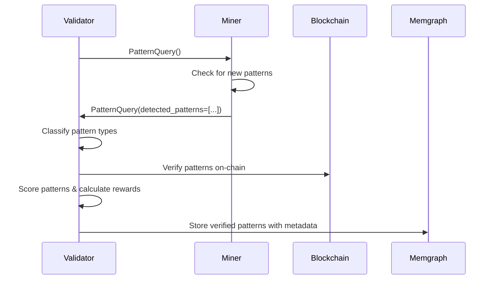

# Chainswarm Patterns Subnet Protocol Specification

## Overview

The Chainswarm Patterns Subnet is a Bittensor-based distributed system for detecting malicious transaction patterns across multiple blockchains. Miners detect suspicious transaction patterns and submit them as graph structures to validators, who verify, classify, score, and store the patterns.

## Core Protocol Flow



## Data Contracts

### 1. Primary Communication Synapse

```python
class PatternQuery(bt.Synapse):
    """
    Single synapse for pattern query and response.
    Validator sends empty request, miner fills detected_patterns.
    """
    # Request (sent by validator)
    query_timestamp: int = field(default_factory=lambda: int(time.time()))
    
    # Response (filled by miner)
    detected_patterns: Optional[List[DetectedPattern]] = None
    
    def deserialize(self) -> List[DetectedPattern]:
        """Return detected patterns for validator processing"""
        return self.detected_patterns or []
```

### 2. Miner Pattern Submission

```python
@dataclass
class DetectedPattern:
    """
    Raw pattern detected by miner - minimal data only.
    Validator adds classification, scoring, and IDs later.
    """
    transaction_graph: TransactionGraph
    blockchain: str                    # "ethereum", "bitcoin", etc.
    asset_symbol: str                  # "ETH", "BTC", "USDT", etc.
    detection_timestamp: int           # Unix timestamp when pattern detected

@dataclass
class TransactionGraph:
    """Graph structure with nodes (addresses) and edges (transactions)"""
    nodes: List[GraphNode]
    edges: List[GraphEdge]

@dataclass
class GraphNode:
    """Address node in transaction graph"""
    address: str                       # Blockchain address
    node_type: str                     # "eoa", "contract", "exchange", "unknown"
    metadata: Dict[str, Any] = field(default_factory=dict)

@dataclass
class GraphEdge:
    """Transaction edge connecting two addresses"""
    from_address: str                  # Source address
    to_address: str                    # Destination address
    amount: Decimal                    # Transaction amount
    transaction_hash: str              # Blockchain transaction hash
    timestamp: int                     # Transaction timestamp
    metadata: Dict[str, Any] = field(default_factory=dict)
```

## Validator Processing Pipeline

### 1. Pattern Classification

Validators classify received patterns into types:

```python
class PatternType(Enum):
    SMURFING = "smurfing"                    # Breaking large transactions into smaller ones
    LAYERING = "layering"                    # Complex chains to obscure origin
    CIRCULAR_TRANSFER = "circular_transfer"   # Tokens moving in loops
    WASH_TRADING = "wash_trading"            # Artificial volume creation
    MIXER_TUMBLER = "mixer_tumbler"          # Privacy coin mixing patterns
    SUSPICIOUS_VOLUME = "suspicious_volume"   # Unusual volume patterns
    RAPID_FIRE = "rapid_fire"                # High-frequency micro-transactions
    CUSTOM = "custom"                        # Novel emerging patterns
```

### 2. Pattern Verification

Validators verify patterns against blockchain data:

```python
@dataclass
class PatternVerificationResult:
    """Results of on-chain pattern verification"""
    pattern_id: str
    is_valid: bool
    verification_timestamp: int
    
    # Verification checks
    addresses_exist: bool
    transactions_verified: int
    total_transactions: int
    verification_confidence: float
    
    # Issues found
    verification_errors: List[str]
    suspicious_flags: List[str]
```

### 3. Pattern Scoring

Validators score patterns using weighted algorithm:

```
Final Score = (
    Classification Accuracy × 0.25 +
    Pattern Complexity × 0.30 +
    Data Recency Balance × 0.20 +
    Volume Significance × 0.15 +
    Pattern Uniqueness × 0.10
) × Miner Reputation Multiplier
```

### 4. Stored Pattern Structure

```python
@dataclass
class StoredPattern:
    """Pattern as stored in Memgraph with validator metadata"""
    # Original miner data
    transaction_graph: TransactionGraph
    blockchain: str
    asset_symbol: str
    detection_timestamp: int
    
    # Validator additions
    pattern_id: str                    # Validator-generated unique ID
    pattern_hash: str                  # Hash for deduplication
    pattern_type: PatternType          # Validator classification
    confidence_score: float            # Validator confidence in classification
    
    # Scoring results
    pattern_score: float
    complexity_score: float
    uniqueness_score: float
    
    # Metadata
    miner_hotkey: str
    validator_hotkey: str
    verification_timestamp: int
    verification_status: str
    
    # Anti-gaming
    is_duplicate: bool
    similar_patterns: List[str]
```

## Usage Examples

### Validator Side

```python
async def query_miners_for_patterns(self):
    """Query all miners for new patterns"""
    query = PatternQuery()
    
    responses = await self.dendrite.query(
        axons=self.metagraph.axons,
        synapse=query,
        timeout=30
    )
    
    all_patterns = []
    for response in responses:
        patterns = response.deserialize()
        all_patterns.extend(patterns)
    
    return all_patterns

async def process_received_patterns(self, patterns: List[DetectedPattern]):
    """Process patterns from miners"""
    for pattern in patterns:
        # 1. Classify pattern type
        pattern_type = self.classify_pattern(pattern)
        
        # 2. Verify on blockchain
        verification = await self.verify_pattern_on_chain(pattern)
        
        # 3. Score pattern
        score = self.calculate_pattern_score(pattern, verification)
        
        # 4. Store in database
        await self.store_pattern(pattern, pattern_type, verification, score)
```

### Miner Side

```python
async def handle_pattern_query(self, synapse: PatternQuery) -> PatternQuery:
    """Respond to validator pattern query"""
    # Get new patterns detected since last query
    new_patterns = self.get_new_patterns_buffer()
    
    # Fill response
    synapse.detected_patterns = new_patterns
    
    # Clear buffer after submission
    self.clear_patterns_buffer()
    
    return synapse

def detect_and_buffer_patterns(self):
    """Continuously detect patterns and buffer for next query"""
    # Run pattern detection algorithms
    detected_patterns = self.run_pattern_detection()
    
    # Add to buffer
    for pattern in detected_patterns:
        self.patterns_buffer.append(DetectedPattern(
            transaction_graph=pattern.graph,
            blockchain=pattern.blockchain,
            asset_symbol=pattern.asset,
            detection_timestamp=int(time.time())
        ))
```

## Anti-Gaming Mechanisms

### 1. Pattern Deduplication

- **Level 1**: Quick hash comparison for exact duplicates
- **Level 2**: Graph signature similarity (structural comparison)  
- **Level 3**: Detailed graph isomorphism analysis
- **Threshold**: 85% similarity = duplicate

### 2. First-Discovery Rule

- Only first miner to submit pattern gets full credit
- 5-minute grace period for network delays
- Partial credit (50%) within grace period
- Zero credit after grace period

### 3. Gaming Detection

| Gaming Type | Detection Method | Penalty |
|-------------|------------------|---------|
| **Address Age Gaming** | >70% new addresses flagged | 50% score reduction |
| **Artificial Complexity** | Meaningless circular transactions | Pattern rejection |
| **Coordination** | Similar timing/structures between miners | Watchlist + penalties |
| **Pattern Farming** | >5 similar patterns per hour | Rate limiting |
| **Duplicate Submission** | Hash collision detection | Zero score |

### 4. Miner Reputation System

```python
@dataclass
class MinerReputation:
    """Tracks miner reputation and performance"""
    miner_hotkey: str
    
    # Basic statistics
    total_patterns_submitted: int
    verified_patterns: int
    average_pattern_score: float
    
    # Anti-gaming metrics
    historical_pattern_ratio: float     # Historical vs recent patterns
    duplicate_submission_count: int
    gaming_penalty_score: float
    
    # Reputation multiplier applied to pattern scores
    reputation_multiplier: float        # 0.1-2.0 range
```

## Blockchain Integration

### Supported Blockchains (Phase 1)

| Blockchain | Priority | Interface Type |
|------------|----------|----------------|
| Bitcoin | High | RPC |
| Ethereum | High | RPC + API |
| BSC | High | RPC |
| Polygon | Medium | RPC |
| Avalanche | Medium | RPC |
| Arbitrum | Medium | RPC |
| Optimism | Medium | RPC |
| Solana | Low | RPC |

### Verification Process

```python
async def verify_pattern_on_chain(self, pattern: DetectedPattern) -> PatternVerificationResult:
    """
    1. Verify each transaction exists on blockchain
    2. Confirm transaction details match (amounts, addresses, timestamps)
    3. Validate address existence
    4. Check transaction success status
    5. Calculate verification confidence score
    """
```

## Memgraph Storage Schema

### Pattern Storage Structure

```cypher
// Pattern node with complete metadata
CREATE (p:Pattern {
    pattern_id: $pattern_id,
    pattern_type: $pattern_type,
    blockchain: $blockchain,
    asset_symbol: $asset_symbol,
    miner_hotkey: $miner_hotkey,
    validator_hotkey: $validator_hotkey,
    pattern_score: $pattern_score,
    complexity_score: $complexity_score,
    detection_timestamp: $detection_timestamp,
    verification_timestamp: $verification_timestamp,
    pattern_hash: $pattern_hash,
    transaction_graph: $transaction_graph,
    is_duplicate: $is_duplicate,
    verification_confidence: $verification_confidence
})

// Address nodes
CREATE (a:Address {
    address: $address,
    blockchain: $blockchain,
    node_type: $node_type
})

// Transaction edges
CREATE (a1:Address)-[t:TRANSACTION {
    amount: $amount,
    transaction_hash: $hash,
    timestamp: $timestamp,
    block_number: $block_number
}]->(a2:Address)
```

## Performance Specifications

### System Limits

| Component | Limit | Rationale |
|-----------|-------|-----------|
| Patterns per query | 10 | Network bandwidth |
| Patterns per hour per miner | 10 | Anti-gaming |
| Graph nodes per pattern | 100 | Processing efficiency |
| Graph edges per pattern | 500 | Memory constraints |
| Verification timeout | 30 seconds | User experience |

### Rate Limiting

- **Miner submissions**: 10 patterns/hour
- **Blockchain queries**: Varies by provider (5-100/second)
- **Database writes**: 1000 patterns/minute
- **Verification requests**: 50/minute per validator

## Security Considerations

### Attack Vectors and Mitigations

| Attack Vector | Mitigation Strategy |
|---------------|-------------------|
| **Sybil Attacks** | Reputation system + stake requirements |
| **Pattern Flooding** | Rate limiting + quality scoring |
| **Fake Patterns** | On-chain verification + penalties |
| **Coordination** | Timing analysis + structural comparison |
| **Data Poisoning** | Multi-validator consensus + verification |

## Success Metrics

### Technical KPIs

- **Pattern Detection Rate**: Patterns detected per hour
- **Verification Success Rate**: % of patterns successfully verified
- **False Positive Rate**: % of patterns flagged as gaming
- **System Latency**: Average time from detection to storage
- **Blockchain Coverage**: % of supported blockchains active

### Business KPIs

- **Pattern Uniqueness**: % of novel patterns discovered
- **Miner Participation**: Number of active miners
- **Data Quality Score**: Average pattern complexity and accuracy
- **Real-time Detection**: Patterns detected within 1 hour of occurrence
- **ML Training Value**: Quality of exported training data

## Implementation Notes

1. **Minimal Miner Data**: Miners only submit raw transaction graphs - no scoring or classification
2. **Validator Processing**: All pattern analysis, scoring, and metadata addition happens on validator side
3. **Clean Separation**: Clear separation between miner detection and validator verification/scoring
4. **Graph-Centric**: Transaction patterns represented as graphs for sophisticated analysis
5. **Anti-Gaming Focus**: Multiple layers of protection against coordination and artificial patterns